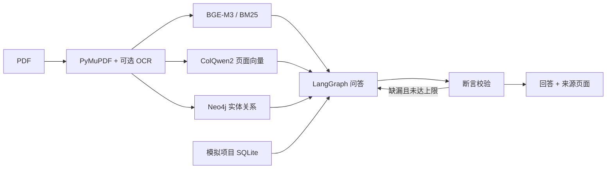

# 实验室多模态知识 Agent

基于 LangGraph 的单用户研究演示项目。它将 PDF 页面、文本块和显式导入的模拟实验记录接入检索，返回可打开的页码证据，并对回答断言进行二次检查。项目记录始终标记为**模拟**。

## 当前实现

- PDF SHA-256 去重、逐页 PNG 渲染、原生文本块提取；可选 PP-StructureV3 OCR 与版面解析。
- BGE-M3 文本向量、BM25、ColQwen2 页面多向量与 Qdrant MaxSim；按页 RRF 融合。视觉通道默认关闭，需要 CUDA GPU。
- Neo4j 中的论文、方法、数据集、实验、参数等实体与证据关系；四类受限图查询。
- LangGraph 的问题拆解、并行检索、证据合并、生成、逐断言校验和最多两轮补检；SQLite checkpoint。
- FastAPI、Streamlit、模拟项目运行链、SSE 状态、证据页与区域裁剪。



## 快速启动（建议 Linux / Python 3.12）

1. 建立虚拟环境：`python3.12 -m venv .venv && source .venv/bin/activate`。
2. 安装依赖：`pip install -e '.[ui,eval]'`。GPU 环境另装 `pip install -e '.[vision,ocr]'`；PaddlePaddle 应按 [官方安装说明](https://www.paddlepaddle.org.cn/install/quick) 选择 CUDA 对应版本。
3. `cp .env.example .env`，填写 `LAB_OPENAI_API_KEY`、`LAB_CHAT_MODEL`。使用兼容 OpenAI Chat Completions 的多模态接口时填写 `LAB_OPENAI_BASE_URL`。如果启用 Neo4j，填写与 `docker-compose.yml` 一致的 `LAB_NEO4J_PASSWORD`。
4. `docker compose up -d`，然后启动 `uvicorn lab_agent.api:app --host 0.0.0.0 --port 8000` 与 `streamlit run ui.py`。
5. `lab-agent seed-demo` 导入 3 个模拟项目，随后上传论文 PDF。也可先运行 `python demo/make_smoke_pdf.py` 并上传生成的合成报告作烟雾测试。

`.env` 中 `LAB_ENABLE_VISION=true` 才会构建及查询视觉索引；`LAB_ENABLE_OCR=true` 才处理扫描页 OCR。若需验证无文本层页面，运行 `python demo/make_scanned_copy.py 原始.pdf 扫描版.pdf`。关闭 OCR 且启用视觉时，扫描页仍可按图像召回；回答模型需支持图像输入才能解释该页。完整能力要求云 GPU、Qdrant、Neo4j、模型 API 全部可用。

**受限网络说明：**仓库未附依赖锁文件。当前开发环境的包源无法下载 LangGraph，因此没有生成可信锁文件或声称已完成端到端验证。在联网环境中安装固定依赖后应生成 `pip freeze > requirements.lock.txt`，记录 CUDA、驱动和模型修订号，再运行以下验收流程。

## 数据与评测

`python demo/fetch_corpus.py` 可从 OpenAlex 获取最多 30 篇开放获取论文 PDF，并保存 DOI、来源 URL 与 SHA-256 到 `demo/corpus/manifest.json`。论文选择是动态的，必须人工审阅相关性、许可、页面数及是否可下载；目前仓库没有预置真实论文，也没有宣称达到 30 篇或 300—500 页。`demo/projects.json` 是明确标注的模拟记录。

用 `eval/benchmark.example.jsonl` 的格式制作**人工标注**评测集。每行包含问题、正确来源页、必要事实、可回答性和 dev/test 分组。完成至少 20 道开发题及 40 道冻结测试题后运行：

```bash
python eval/evaluate.py eval/benchmark.jsonl --variant full --output eval/full.json
```

脚本计算页面 Recall@5/10、完成率和延迟，并保存原始回答。事实正确率、引用支持率、无依据断言率必须人工复核，不能用 Agent 自评替代。做消融时分别更改 `.env` 中视觉/图谱/模型校验设置，重启服务，固定同一语料、问题、模型与证据预算；当前版本尚未提供一键消融配置，结果也尚未测量。

## API 与数据语义

OpenAPI 文档位于 `/docs`。关键接口是 `POST /documents`、`GET /jobs/{id}`、`POST /queries`、`GET /queries/{id}/events`、`GET /documents/{id}/pages/{page}`、`POST /projects/{id}/runs`、`GET /projects/{id}/lineage` 及 `POST /graph/query`。

页面号为从 1 开始的 PDF 物理页码。`bbox` 是 PDF 页面坐标；只有解析器确实给出坐标时才返回区域，视觉检索命中本身只定位页面。`version_id` 当前是文件 SHA-256；重复内容不会创建新版本。项目运行记录保存在 SQLite，Neo4j 是可重建的关系投影。LangGraph checkpoint 只保存问答执行状态，不替代业务记录，也不保证外部操作恰好一次。

`LAB_ALLOW_TEXT_ONLY=true` 允许查询在向量服务故障时退回 BM25。入库仍要求 Qdrant 可用，以避免把未完成索引的文档标记为 ready。未配置模型 API 时系统展示带来源的检索片段，而不生成综合论断。

## 验证状态

已在本地完成 Python 语法编译和 SQLite 存储单元测试。尚未在此环境验证 LangGraph、Qdrant、Neo4j、ColQwen2、PP-StructureV3 或模型 API 的端到端调用；部署前需完成 20 页显存试验、全链路测试和人工评测。
